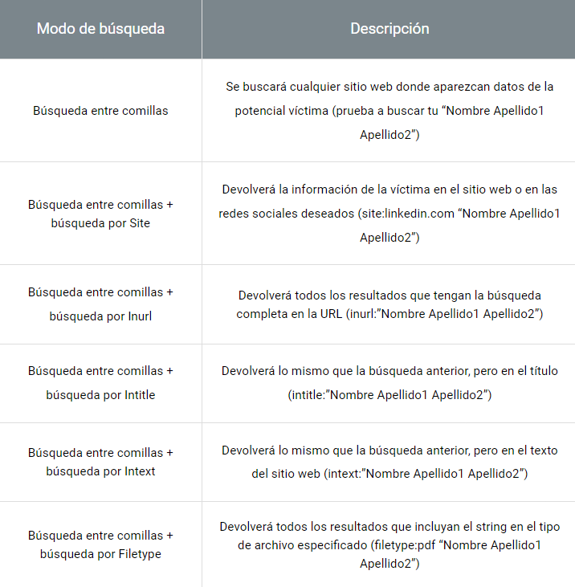

# 1. Cyber Intelligence

## Key Definitions

**Cyber Intelligence**: The process of collecting and analyzing data from the digital domain to identify potential threats and malicious activities, with the aim of supporting security decision-making and protecting digital assets.

- Cyber intelligence teams are essential for other security areas, as they identify threats, understand every detail of these threats, and share crucial information with other analysts to strengthen defense.

**Phishing**: Impersonation of a website or application to illegitimately obtain any type of sensitive or confidential information from a user.

**Brand Abuse**: Using a third-party brand to gain personal benefits, either directly or indirectly.

**Malware**: Malicious software created to carry out harmful actions on a device.

**ATS (Automatic Transfer System)**: Technique used by bankers to, after infecting a device or illegally accessing a bank account, carry out automatic transfers to the attacker’s mule accounts.

**Mule Account**: Bank account used to move money illegally after a crime. It can be controlled by attackers, "hired" owners for moving the money, or "mules," who withdraw the money from these funds at ATMs.

**DGA (Domain Generation Algorithm)**: Technique used to generate new domains periodically, which will be used for malicious activities.

**419 Scam (Nigerian Letter)**: Fraud where the attacker contacts the victim, usually by email or phone, to request an initial payment, promising a large reward. Examples include inheritance from a "Nigerian prince" or lottery winnings.

**SOC (Security Operations Center)**: Center with advanced technological infrastructure for analysis, prevention, monitoring, and other tasks. Teams of technicians and analysts collaborate to prevent and detect threats in real time:

- **24 × 7 (N1)**: They work continuous shifts to initially respond to incidents and alerts.
- **SIEM (Security Information and Event Management)**: They monitor the network and organize events by grouping them to generate alerts about potential threats.
- **Infrastructure Protection**: They deploy, manage, and monitor security devices on the network.
- **SMA (Social Monitoring & Analytics) and SI (Social Intelligence)**: They analyze the brand's online reputation and protect its digital presence.
- **Code Review or AP (Application Protection)**: They evaluate application code to fix vulnerabilities and ensure secure development.
- **CSIRT (Computer Security Incident Response Team) and TIA (Threat Intelligence & Analytics)**: They manage fraud and perform technical analysis of malware and threats.
- **Ethical Hacking and VM (Vulnerability Management)**: They conduct penetration testing and vulnerability analysis to improve security.

**CERT (Computer Emergency Response Team)**: Team that implements preventive and reactive measures to alert entities about security incidents; present in most countries and trusted by ISPs.

**Spoofing**: Techniques used for identity impersonation.

---

## Social Engineering

**Ingeniería social:** Set of techniques used to manipulate victims into providing desired information or performing actions that help the attacker compromise the system.

**Google Dorks**: Advanced search technique that uses specific operators to find detailed information on websites. 

**Creation of a Digital Identity:** The goal is to generate trust in research environments such as forums or markets where compromised information is shared:

- The identity must be as realistic as possible, with a social media profile, email addresses, and any additional data required to access restricted forums or establish contacts.
- It is important to hide IP and maintain consistency in the user-agent and other technical data from the account creation to protect privacy and avoid generating alerts.
- Prepaid SIMs should be used, although obtaining them without an ID may be difficult.
- **Available tools**:
    - **Udger**: Provides a list of valid user-agents for different browsers [https://udger.com/resources/ua-list](https://udger.com/resources/ua-list)
    - **Fake Name Generator**: Facilitates the creation of a fake digital identity with a wide range of details [https://es.fakenamegenerator.com/](https://es.fakenamegenerator.com/)
    - **CIPRG**: Displays IP ranges by country.
    - **Mailinator**: Allows the use of email inboxes without registration (but public domain) [https://www.mailinator.com/](https://www.mailinator.com/)
    - **Spam Gourmet**: A portal that receives emails and privately redirects them to the assigned email account [https://www.spamgourmet.com/index.pl](https://www.spamgourmet.com/index.pl)
    - **Sharpmail**: Sends emails anonymously.
    - **Receive SMS Online**: A portal that allows receiving SMS without a registered number.

**CEO fraud**: Impersonation of a company's CEO to exploit the pressure from their position to make an employee urgently and confidentially process payments.

- **Steps:**
    1. Gather information about the CEO.
    2. Gather information about the CFO (it would be suspicious for the CEO to directly contact the financial department).
    3. Obtain emails from both the CEO and CFO, and obtain an email from an employee in the financial department.
    4. Create an email that the "CFO" will send to the employee in the financial department, simulating a forwarded email from the "CEO" urgently requesting a transfer for a critical and confidential reason.
    5. Use email spoofing to impersonate the CFO's email.

**Protocols for Email Protection**:

- **SPF (Sender Policy Framework)**: Allows the domain owner to specify which servers can send emails using their domain in the "Mail From" field. It also enables receiving servers to query the list of authorized servers for that domain.
    - **Responses to an SPF query**:
        - **None**: No SPF record found for the domain.
        - **Neutral**: No indication whether the IP is authorized or not.
        - **Pass**: IP authorized to send from the domain.
        - **Fail**: IP not authorized to send from the domain.
        - **Softfail**: Uncertainty about whether the IP is authorized to send from the domain.
        - **Temperror**: Temporary error in SPF verification.
        - **Permerror**: Verification failed.
    - **To configure SPF in the TXT record**:
        - **v**: SPF version.
        - **a**: IP that resolves a domain.
        - **ptr**: Ensures the IP is properly configured.
        - **mx**: MX record IP.
        - **include**: Includes the SPF record of one domain into another.
        - **ip4**: Declares a specific IPv4 address.
        - **ip6**: Declares a specific IPv6 address.
        - **all**: Indicates what to do with an email received from an IP not listed in the record.
- **DKIM (Domainskeys Identified Mail)**: Uses public/private key cryptography to sign emails with the sending domain, ensuring the integrity of the email. Receivers can query the public key in the DNS to verify the signature.
    - **Responses to a DKIM query:**
        - **None**: Not properly signed.
        - **Neutral**: Signed but the signature contains syntax errors.
        - **Pass**: Signed, accepted, and verified.
        - **Fail**: Signed, accepted but failed verification.
        - **Policy**: Signed, but the signature was not accepted.
        - **Temperror**: Temporary inability to retrieve a public key.
        - **Permerror**: Verification failed due to an unrecoverable error.
- **DMARC (Domain-based Message Authentication, Reporting & Conformance)**: Complements SPF and DKIM. When an email is received, it undergoes SPF and DKIM checks. This record allows the owner of the receiving domain to define how to act if either or both checks fail. DMARC configuration can be checked in the domain's TXT record.
    
    **DMARC reports can be received in two formats:**
    
    - **RUA (Reporting URL of Aggregate reports):** Compressed files with detailed statistics about emails sent from a domain, including the number of emails, origin IPs, and SPF/DKIM validations, allowing domain usage monitoring.
    - **RUF (Reporting URI for Forensic reports):** Detailed copies of emails that failed DMARC authentication, providing diagnostic information on potential spoofing attempts.
        - **Values in RUF response**:
            - **v**: Protocol version.
            - **p**: Domain policy.
            - **pct**: % of emails subject to filtering.
            - **fo**: Indicates the type of messages desired:
                - **0**: Both SPF and DKIM fail.
                - **1**: Either SPF or DKIM fails.
                - **d**: DKIM fails.
                - **s**: SPF fails.
            - **rua**: Addresses where RUA reports are sent.
            - **ruf**: Addresses where RUF reports are sent.
            - **aspf**: SPF alignment mode.
            - **adkim**: DKIM alignment mode.
            - **rf**: Format of failure messages.
            - **ri**: Time in seconds before the report is sent to the sender.

---

## Deep Web

**Deep Web**: Portion of the internet not indexed by search engines and thus not available to the general public. Requires specific permissions to access, such as passwords, subscriptions, or direct links. It can include legal content, such as government databases or scientific archives.

**Dark Web**: Portion of the internet within the Deep Web that is intentionally hidden and not indexed by search engines. Unlike the Deep Web, it is not accessible through conventional browsers and can only be accessed using browsers like TOR. Is commonly known for illegal activities.

**TOR Browser (The Onion Router)**: Open-source project designed to enable anonymous communication over the internet. It hides the user's IP address by redirecting their traffic through multiple nodes in the Tor network, preventing the user's identity from being revealed.

- Routes are generated randomly, so connections from node A to node B may follow different paths; the browser itself provides the option to switch to a new route.
- Websites under this project are recognized by the pseudo-TLD they use: **“.onion”**.
- Various **search engines** like **DuckDuckGo** are used to locate websites.

**Underground Forums**: Communities within the Dark Web where users buy and sell illegal products such as phishing tools, malware, or stolen credentials, taking advantage of anonymity.

- Space for interaction between individuals or organizations engaged in cybercrime.
- Sales are made through detailed posts with product proofs to provide credibility.
- Although scams exist, trust and reputation are essential for success in these markets.

**Carding Forums**: Communities where stolen credit card data is traded. Some offers include courses teaching users techniques to avoid detection. Examples: **Boveda**, **Club2CRD**, **EpicMarket**, and **ValidDumps**.

**Stolen Data Markets**: Acquire compromised information by facilitating purchases while focusing on buyer privacy.

- **Unicc.vc** provides direct access to card data.
- **Genesis** sells complete data packages from infected devices, including detailed victim information.

**Remote Access Markets**: Usually classified by country, these markets sell remote access to compromised systems, allowing buyers to take control of vulnerable devices.

- FreshRDP, Basetools, BlackShop, Dedic

**Email Account Access Markets**: Attackers use these accesses to expand bot networks or for identity theft.

**Phishing Kit Markets**: Complete phishing packages are offered, including email templates and fraudulent websites, making the attack process easier for the attacker.

**Collaboration Forums for Threat Actors**: Spaces where cybercriminals collaborate and exchange information on attack methods, malware, and strategies. They are also used for networking or seeking alliances. Analysts infiltrate these forums to gather information without detection.

**Instant Messaging Services**: Some markets include their own internal messaging service for users to negotiate within the same platform. Additionally, there are instant messaging servers outside of the markets, such as [Ajjaber.me](http://ajjaber.me/), offering secure communication.

---

## Phishing and other frauds

**Phishing**: Attackers replicate legitimate websites or apps to steal sensitive data, commonly targeting banks, emails, and online retailers like Amazon or PayPal.

**Pharming**: Redirection technique that stealthily leads users from a legitimate website to a malicious one to steal sensitive data like credentials. Methods include:

- **DNS compromise**: Infiltrating DNS servers to alter IP addresses linked to legitimate domains.
- **Hosts file compromise**: Modifying local entries in the system's hosts file to redirect requests to attacker-controlled IP addresses.

**Malspam**: Massive distribution of malicious emails aimed at spreading phishing or malware. These emails often use attention-grabbing subjects like “URGENT! Access Blocked” and target thousands of users indiscriminately, increasing the chances of reaching unsuspecting victims.

- **Spam trap:** Email account designed to receive spam, used as a honeypot to detect unwanted messages. It is created and exposed on websites, attracting emails from attackers searching for new addresses, helping identify spam activity.
    - **Efficient spam trap:**
        - Having a VPS server allows receiving all incoming emails.
        - Owning multiple domains to create various email accounts.
        - Hosting at least one website with email addresses to attract crawlers.
        - Using different TLDs helps receive spam campaigns globally.
        - Distributing email accounts on forums, social media, and phishing-related platforms.
    - **Steps:**
        1. Rent an IP and domain to associate them.
        2. Set up a server (preferably Linux).
        3. Configure MTA (Mail Transfer Agent): manages email sending. Example: **Postfix**, which listens on port 587.
        4. Install Postfix: `sudo apt-get install postfix`.
        5. Install MDA (Mail Delivery Agent) **Dovecot**: `sudo apt-get install dovecot`.
        6. Install Procmail, another MDA for filtering: `sudo apt-get install procmail`.
        7. Consult additional steps if needed, as the remaining ones are extensive.

**Distribution via paid ads**: Utilizes paid tools like Google Ads to display fraudulent ads that appear legitimate. Clicking on these ads redirects users to phishing websites.

- Short lifespan (2-3 hours due to rapid detection).
- Based on PPC (Pay Per Click); costs increase with clicks.
- Analysts can create a script using Google Ads diagnostics to search for specific terms (keywords linked to suspicious offers) in a particular country and language, enabling proactive measures to halt attacks before user reports emerge.

**Common types of phishing**:

- **Traditional phishing**: Fake page mimicking a single website (e.g., Facebook) distributed massively via email to reach a broad audience.
- **Spear phishing**: More targeted and personalized. The attacker studies the victim beforehand, crafting a convincing message to increase the likelihood of success.
- **Application phishing**: Malicious email with an attachment instead of a web link. When opened, a fake form appears for victims to enter their data, which is sent to the attacker. This method avoids reliance on easily blocked websites.
- **Rock phish**: Attacker hosts multiple phishing pages on a single server, active simultaneously to target various victims. However, this method is easier to detect and block.
- **SMSishing**: Delivers malicious links via SMS instead of email, leveraging the widespread use of mobile devices. It is more costly and risky, as companies can block numbers and mass messages.
- **Vishing**: Phone calls to obtain confidential data through social engineering, without redirecting victims to a website. Often combined with spear phishing for credibility after researching the victim.

**Redirections after completing a phishing attack:**

- **Fake 404 error page**: Victim is redirected to a 404 error page, making them believe the site is unavailable.
    - **Advantage**: Prevents the legitimate site from receiving suspicious traffic from the victim.
    - **Disadvantage**: Victim may suspect the scam and change credentials or block their account.
- **Legitimate site with login error**:
    - **Advantage**: Victim assumes they mistyped credentials, unaware of the scam.
    - **Disadvantage**: Legitimate site logs the visit, potentially triggering fraud detection systems.
- **Legitimate site with successful login**: Credentials are forwarded to the legitimate site, allowing the victim to log in without noticing the fraud.
    - **Advantage**: Victim perceives the process as normal, reducing suspicion.
    - **Disadvantage**: The "Referer" header reveals the phishing URL, aiding detection.

**Términos relacionados con el tráfico generado por la navegación del usuario:**

- **Referer**: URL from which the user navigated to the current page.
- **User-Agent**: Identifies the user's device, operating system, and browser.
- **Content-Type**: Specifies the format of the content in an HTTP request/response, e.g., `text/html`, `application/json`.
- **Request URL**: Full URL of the requested resource.
- **Request Method**: HTTP operation type, such as GET or POST.
- **Status Code**: Indicates the HTTP response status, e.g., 200 (OK), 404 (Not Found).
- **Content-Length**: Size of the response content in bytes.

**Detection tools**:

- **Trusteer**: IBM solution for phishing detection. Monitors **referer** data to identify suspicious site access and generate real-time alerts. [http://www.trusteer.com/es/support](http://www.trusteer.com/es/support)
- **Whois (Domain Tools)**: Database providing domain ownership, contact information, and registration dates. Useful for detecting **cybersquatting** and **typosquatting** (registration of domains similar to a legitimate one) by setting alerts for newly created domains containing specific keywords. [http://whois.domaintools.com/](http://whois.domaintools.com/)
- **Feeds**: Free services where users report and validate phishing websites, creating public lists for detection.
    - **PhishTank** [http://www.phishtank.com/](http://www.phishtank.com/)
    - **OpenPhish** [https://openphish.com/](https://openphish.com/)

**Gophish**: Open-source platform for creating phishing simulation campaigns easily. It allows analysts to design phishing pages and manage simulation emails without advanced programming skills, supporting user training and security assessment. Download: [https://getgophish.com/](https://getgophish.com/)

---

## Malware

**Malware**: Software designed to infiltrate and damage devices. It is one of the most significant threats in cybersecurity due to its constant evolution and the collaboration among attackers.

- **Entry vectors:**
    - **Malspam**: Mass emails with malicious links or attachments to spread malware.
    - **SMS**: Text messages containing malicious links or attachments that download malware.
    - **Misconfiguration**: Exploits weak security settings to access networks, devices, or applications and inject malware.
        - Weak security policies or misconfigured services.
        - Vulnerabilities in systems or software.
        - **RDP (Remote Desktop Protocol) exposed**: Attackers scan for IPs with port 3389 open and gain remote access through brute force attacks.
        - **Citrix exposed**: Brute force attacks on exposed Citrix servers.
    - **Exploit kit**: A collection of exploits to target vulnerabilities and download malware.
    - **External devices**: Infected storage devices, such as USB drives, that install malware when connected to a system.

**Lateral movement**: Technique that allows attackers to move from the initially compromised device to others within the same network, expanding their access. This enables them to access sensitive data or take control of key systems. There are two methods:

- Using tools like **Rdp.bat**, **Wmi1.bat**, and **Run.bat** that help attackers execute commands and move through the network using protocols like RDP.
- Downloading and using tools like **Cobalt Strike**, which allow automated lateral movement by connecting to the C&C. These tools also use WMI or PsExec to execute commands on other devices in the network while remaining undetected.

### **Typologies:**

**Ransomware:** When the machine is infected, it encrypts files, making them inaccessible, and the attacker demands payment from the victim in exchange for the decryption key. The payment is usually made in cryptocurrency to maintain anonymity.

- They often use a **blacklist** to establish certain system files that should not be encrypted, to avoid rendering the system inoperable.
- **The creator of a ransomware has 3 ways to profit:**
    - Use it themselves.
    - Sell it to other cybercriminals for a one-time payment.
    - **RaaS (Ransomware as a Service):** Sell it to other cybercriminals for a percentage of the profits they make from their attacks.
    
- **Ransomware topologies:**
    - **Private key contained in the binary:** The private key is embedded within the malware code itself. By analyzing the code (reversing), the key can be extracted to decrypt files without paying the ransom.
    - **Private key on the C&C server:** The private key is stored on the attacker's C&C server. It is not possible to obtain the key unless communication with the server is intercepted or the server is accessed. In this case, paying the ransom is usually the only option.
    - **Key in an unknown location:** The private key is stored in an unknown location. The only option is to pay the ransom.
    
- **Most relevant ransomware families**:
    - **CryptoLocker**: Stored keys on the C&C server. Though difficult, the key was sometimes recoverable.
    - **Petya**: Encrypted all files, including the MBR (Master Boot Record), completely blocking system access.
    - **Cerber**: Noted for using large IP ranges and UDP connections to port 6893.
    - **Dharma (Crysis)**: Spread by exploiting insecure RDP configurations.
    - **Locky**: Highly obfuscated and professional, difficult to detect.
    - **WannaCry**: Spread globally by exploiting EternalBlue (SMB vulnerability).
    - **NetWalker**: Operated as RaaS, threatening to publish data if the ransom wasn't paid.
    - **Maze**: Operated as RaaS. Popularized double extortion, demanding payment within the first 3 days, after which part of the stolen data would be published. If payment was still not made, the remaining data would be published on the 10th day.

- **Collaboration of different threat actors to increase effectiveness:**
    - **Emotet → TrickBot → Ryuk:**
        - **Emotet:** Starts the infection by sending malicious emails, containing a URL or attachment with VBA macros. When the victim opens the file or clicks the link, Emotet activates and downloads the next malware, TrickBot.
        - **TrickBot:** Expands the infection. First, it disables Windows defenses using console commands and PowerShell. Then, it uses specific modules to gather credentials and move laterally in the network. It also downloads **Empire** (a post-exploitation tool) to facilitate network propagation and communicates with its C&C server through compromised routers.
        - **Ryuk:** Finalizes the attack by encrypting files across the compromised network and demanding ransom, representing the monetization phase of the attack.
    - **Ostap → TrickBot → Ryuk**:
        - **Ostap**: Initiates the attack through malicious emails, sending obfuscated VBA macros that download a ".JSE" (encrypted JavaScript) file, which is hard to detect. This file establishes communication with specific URLs and downloads parts of **TrickBot**.
        - **TrickBot:** Executes the previously described actions.
        - **Ryuk:** Executes the previously described actions.
    - **Dridex → BitPaymer:**
        - **Dridex: B**anking trojan primarily distributed via malspam. Known for evading detection by obfuscating its security environments. Once the system is infected, it connects to its C&C servers to download **Empire**, aiding malware propagation within the network.
        - **BitPaymer**: Activates when enough devices are compromised. This ransomware uses a custom packer and a hybrid encryption system (asymmetric encryption to share the symmetric key, then symmetric key encryption for file encryption). It also customizes encrypted file extensions and ransom notes with the attacked company’s name, making data recovery harder without paying the ransom, as the attack appears more robust and personalized.
        

**Infostealer**: Designed to collect sensitive information from infected devices. Notable for its ability to persist in systems for extended periods and its high distribution rate.

1. **Infection**: Infects the machine and turns it into a bot.
2. **Evasion**: Hides itself to avoid detection by the user and security tools.
3. **Persistence**: Creates a persistence task to remain active after system reboots.
4. **Monitoring**: Collects information from the services it has been configured to target.
5. **Exfiltration**: Periodically sends the collected information to the C&C.

- **Techniques for Information Theft**:
    - **Keystrokes:** Records the user's keyboard presses to capture entered information, such as passwords or sensitive data on websites.
    - **Screenshots:** Takes screenshots at key moments, such as when interacting with virtual keyboards, to capture authentication data or personal information.
    - **MitM o MitB:** Intercepts network traffic or communication between the browser and the server to capture transmitted data, such as credentials or banking information.
    
- **Infostealer Families:**
    - **Pony:** Malware distributed in campaigns and bundles with other types of malware. Its "Password_modules.php" module contains functions to steal sensitive information such as passwords.
    - **LokiBot:** Similar to Pony, but with more organized code. Its "Pass_modules" directory includes multiple functions for stealing information.
    - **Agent Tesla:** An infostealer/keylogger marketed as a MaaS (Malware as a Service). It collects information from Windows applications and sends it to the attacker via SMTP or FTP.

**Keylogger**: Malware designed to record all keystrokes and user activities on an infected machine. It ensures persistence, evades detection, and then sends the information to a C&C server.

- **Predator Pain**: This family captures credentials, screenshots, and keystrokes. It uses tools like *WebBrowserPassView* and *MailPassView* to steal information from services and stores it in temporary files, which are then sent to the C&C via email.

**Banker**: Malware designed to steal banking credentials through redirection, MitB (Man-in-the-Browser), and MitM (Man-in-the-Middle) techniques. It hides in the system, maintains persistence, and monitors browsing to detect banking websites. Upon detection, it injects malicious code to obtain passwords and bypass security measures, enabling unauthorized transactions.

- Once settled in the system, the banker downloads the **configuration file** that describes how the malware adapts and customizes its attack based on the target. Key parameters include:
    - **Set_url**: Defines the URL that triggers the malware when the infected user visits it.
    - **Data_before**: Specifies the exact point in the webpage's code before which malicious code will be injected.
    - **Data_end**: Marks the end of the area where code injection occurs. It's not always used, but is helpful for delimiting the injection region.
    - **Data_inject**: The malicious code inserted into the user's browser on the targeted webpage, without altering the original site, helping to avoid detection and directly compromising the banking entity's page.
    
- **Injection types:**
    - **Injection in User and Password Input**: An old technique where login fields are modified to steal credentials, now less effective due to the use of MFA.
    - **Additional Fields for MFA**: Injection into additional fields (like security questions) or redirection to fake sites to capture additional authentication factors. E.g. *Dridex* and *Ursnif*.
    - **Man-in-the-Browser (MitB)**: Captures credentials and sensitive data through browser-based attacks, especially in business accounts with frequent transactions. E.g. *Dyreza* and *TrickBot*.
    - **Post-Access Social Engineering**: After accessing the banking portal, the malware simulates fake transactions or account lockouts to trick the victim. The victim is advised to return transactions supposedly received by mistake and loses that money.
    - **MFA Capture via Mobile**: Sends malicious SMS to intercept MFA authentication codes, approving fraudulent banking transactions. E.g. PandaBanker.
    - **Bypass of Physical Tokens**: A technique that deceives the victim to obtain sensitive information (like physical tokens, card numbers, and PIN) through a fake login. E.g. *Dridex* and *GootKit*.

- **Main Banker Families:**
    - **Dridex**: Sophisticated malware spread through botnets targeting financial institutions and using advanced anti-analysis techniques.
    - **GootKit**: Combines various malware techniques with anti-analysis features, focusing on stealing banking credentials.
    - **PandaBanker**: Uses a unique configuration and multiple botnets, often combined with other malware like **Hancitor**.
    - **BankBot**: Android Trojan that mimics legitimate banking apps through overlay attacks to steal credentials.
    - **TrickBot**: A long-lasting Trojan that avoids traditional C&C servers by using compromised machines as relay points.
    - **Cerberus**: A mobile banking Trojan for Android that steals credentials through overlays, with notable activity in Spain and Italy.
    - **Grandoreiro**: A Brazilian Trojan that uses RAT-like techniques and overlays to bypass two-factor authentication and steal credentials.

**Miner**: Malware that turns infected machines into bots to mine cryptocurrency for the benefit of cybercriminals.

- Targets environments with high computing capacity, such as universities, ISPs, and critical infrastructures.
- Overloads systems, compromising their performance and causing potential downtime.
- Hides to avoid detection and activates only when system performance is low.
- Spreads through vulnerabilities like **EternalBlue**.

**Backdoor**: Malware that creates a "backdoor" in the infected system, allowing the attacker to gain full remote access to the device. Example: **Andromeda**.

- The cybercriminal can perform any action, such as stealing information, installing more malware, or manipulating the system.
- Designed to be persistent, it stays hidden and allows the attacker to access the system again in the future without detection.

**RAT (Remote Access Trojan)**: Malware that allows the attacker to take remote control of the victim's machine.

- Operates covertly, without appearing in active processes or system tasks, to avoid detection by the user or security tools.
- Unlike a backdoor, which provides persistent access, a RAT is designed for real-time control. It allows the attacker to perform various actions, such as:
    - Stealing information with keyloggers
    - Installing other trojans or spying on the user.
- **njRAT (Bladabindi)**: Known for its capabilities in credential theft, keylogging, screenshot capturing, audio and video recording, and file manipulation.

 

**IOC (Indicators of Compromise)**: Structured data (.stix) that describes patterns associated with malicious activities, such as IPs, URLs, hashes, or process names. They are used to compare these patterns with real-time situations to detect potential attacks.

**MISP (Malware Information Sharing Platform):** Open-source platform used by security analysts to store, share, and correlate malware IOCs. It can be installed locally or on servers and allows organizations to access and share IOCs from different sources to enhance detection and prevention of attacks. [http://www.misp-project.org/](http://www.misp-project.org/)   [https://github.com/MISP/MISP](https://github.com/MISP/MISP)

- **Server or Instance**: The MISP installation on the organization's server. It allows the management of local IOCs and synchronization with other instances for sharing IOCs.
- **Event**: A documented security incident that includes metadata and attributes, such as IOCs associated with the threat.
- **Attributes**: Individual IOCs within an event.
- **Tags**: Labels used to classify related events (e.g., grouping ransomware events).
- **Taxonomies**: Collections of related tags.
- **Organisation**: Local organizations within a MISP instance are registered, and each user belongs to one.
- **Community**: The set of organizations registered in a MISP instance.
- **Sharing Group**: A custom group of organizations that can share specific events or attributes among themselves.
- **Proposal**: Allows users to add information to events not owned by them, for review and potential acceptance by the event owner.
- **Roles:**
    - **Admin**: Full control over the instance.
    - **Org Admin**: Similar to Admin but with control limited to the organization.
    - **Publisher**: Creates, modifies, and publishes events.
    - **User**: Can create and manage only their own events.
    - **Sync User**: Synchronizes data between MISP instances without modifying events.
    - **Read Only**: Can only view events accessible to their organization.
- **Levels of information exchange:**
    - **Your organization only**: Event accessible only to members of the organization.
    - **This community only**: Event accessible only to members of the same community.
    - **Connected communities**: Event accessible to members of the same community and neighboring communities.
    - **All communities**: Event accessible to all communities.
    - **Sharing group**: Event accessible to a specific group of organizations.

**MaaS (Malware as a Service):** A model where cybercriminals access malware developed by third parties without having to create it themselves.

- **Pay Per Install (PPI)**: The attacker pays a botmaster to use their botnet to spread the malware. The attacker pays for each installation of the malware.
- **Crime as a Service (CaaS)**: A more advanced model that allows not only distribution but also customization of malware to target specific objectives and maximize its impact. The attacker keeps the benefits of the attack while the provider charges for the distribution and modification of the malware.
- **Sale of access to infrastructure:** Involves selling credentials or access to already compromised networks, allowing other attackers to install additional malware.

**YARA rules:** Patterns used to detect malware based on strings, regular expressions, or specific sequences within suspicious files, enabling efficient detection.

- **YARA rule sections:**
    - **Rule identifier**: A header that starts with `rule <rule-name> {`.
    - **Meta**: Non-operational information (author, date).
    - **Strings**: Key variables preceded by `$`, representing specific detection patterns, with case sensitivity.
    - **Condition**: Sets the logic for rule activation using operators `AND` and `OR` to trigger alerts only when the necessary criteria are met.
- Example: `$C1 AND $C2 AND $C3`, the alert triggers only when all three conditions are met together, as a pair alone wouldn't indicate malware but the combination of all three would.

**Evasion Techniques**: Malware developers use these techniques to hide the malware's actions and make detection more difficult in virtual environments or automated analysis systems like sandboxes.

- **Reverse Engineering Obstacles**: Advanced coding techniques to confuse or break code analysis.
    - **Anti-disassembly techniques**:
        - **Junk Instructions**: Introduce unnecessary commands that don't alter the program's flow but confuse the analyst.
        - **Constant Conditional Jumps**: Insert jumps that always meet the condition, complicating the analysis.
        - **Jumps to the same destination**: Two jumps with opposing conditions but leading to the same place, evading detection.
- **Detection of Virtual Environments**: Malware will terminate or hide its actions if it detects an analysis environment (VM or sandbox).
    - **Anti-debugger techniques**:
        - **IsDebuggerPresent()**: Checks the `BeingDebugged` flag in the PEB (Process Environment Block)
        - **NtGlobalFlag**: Checks if the `NtGlobalFlag` field in the PEB indicates a value suggesting debugging.
        - **CheckRemoteDebuggerPresent()**: Verifies if the program is being debugged via a boolean.
        - **Debugger Exceptions**: Generates intentional exceptions that, when debugging, would pass control to the debugger instead of the handler.
        - **Timing Checks**: Measures time between key points in the code; if the execution is slowed down, it suggests debugging.
    - **Anti-VM (Virtual Machine) Techniques**:
        - **Registry Keys**: Searches for keys typically present in VMs.
        - **System Files and Directories**: Identifies files and folders common in virtual environments.
        - **MAC Addresses and Processes**: Recognizes patterns in MAC addresses typical of VMs and specific VM processes.
        - **CPUID and Red Pill**: Uses the CPUID command and the "Red Pill" technique to detect anomalies typical of virtualization.

---

## TDS (Traffic Director System)

**SEO** **(Search Engine Optimization)**: Techniques used to improve a website's visibility in search engine results, thereby increasing traffic and site visits.

**TDS (Traffic Distribution System)**: A SEO technique that redirects relevant traffic to a website to improve its visibility and ranking in search engines.

- By extracting parameters from web requests (IP, browser, time), rules are created to redirect traffic to specific URLs based on potential interests.
- The TDS is configured by the page admin where the ads are located, as their goal is to get more clicks on ads to earn more.
- When used maliciously, it can redirect users to malicious pages, displaying fake ads, false infection alerts, or counterfeit software download portals.

**Malicious TDS Tools:**

- **BlackTDS**:
    - A cybercriminal can hire this service, then receives a dedicated domain to redirect malicious traffic.
    - It provides a control panel to configure traffic redirection based on parameters such as geolocation, OS, browser, and access times.
    - Offers deceptive ads and predefined malicious download files, which can be customized for the attacker to enhance the deception.
    - Supports additional domains and allows control over access through blacklists to prevent researchers from accessing malicious content.
- **BlackHat-TDS**: Similar to BlackTDS, but with a business model based on more expensive licenses, requiring cryptocurrency payments. It offers advanced filtering features and more customization options for malicious redirection.